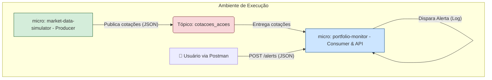

## 📈 Simulador de Ativos da Bolsa de Valores com Java, Spring Boot e Apache Kafka

Este projeto simula um ambiente de processamento de dados financeiros em tempo real, utilizando uma arquitetura de microsserviços reativa e orientada a eventos. A aplicação consiste em um serviço que gera cotações de ações (**Producer**) e outro que consome essas cotações para monitorar alertas de preços definidos pelo usuário (**Consumer**).

Este é um projeto de portfólio, idealizado para demonstrar competências avançadas em desenvolvimento back-end, arquitetura de software e tecnologias de streaming de dados.

---
## 🏗️ Arquitetura do Sistema

A arquitetura foi desenhada para ser desacoplada, resiliente e escalável, seguindo os princípios de microsserviços. A comunicação entre os serviços é feita de forma assíncrona através do **Apache Kafka**, que atua como a espinha dorsal do sistema.


---

## ✨ Decisões Técnicas e Arquiteturais

* **Microsserviços:** separação em *market-data-simulator* e *portfolio-monitor* para permitir evolução e escalabilidade independentes.
* **Apache Kafka como Message Broker:** escolhido pela alta vazão, tolerância a falhas e persistência de eventos.
* **Arquitetura Limpa / Hexagonal:** organização em `domain`, `application`, `infrastructure` para isolar regras de negócio dos detalhes de infraestrutura.
* **Comunicação Assíncrona:** eventos desacoplam produtor e consumidores, facilitando expansão do ecossistema.
* **Docker & Docker Compose:** ambiente reproducível para desenvolvimento e testes locais.

---

## 🛠️ Tecnologias Utilizadas

| Tecnologia       | Versão/Tipo | Descrição/Propósito                                           |
| ---------------- | ----------- | ------------------------------------------------------------- |
| Java             | 21          | Linguagem principal; uso de recursos modernos (Records, etc.) |
| Spring Boot      | 3.x         | Framework para microsserviços                                 |
| Apache Kafka     | 3.x         | Plataforma de streaming e message broker                      |
| Spring for Kafka | -           | Integração simplificada com Kafka                             |
| Docker           | -           | Contêineres para executar Kafka e dependências                |
| Maven            | -           | Build e gerenciamento de dependências                         |
| Lombok           | -           | Redução de boilerplate                                        |
| Postman          | -           | Testes da API de alertas                                      |

---

## 🚀 Como Rodar o Projeto

### Pré-requisitos

* Git
* JDK 21 (ou superior)
* Maven 3.8+
* Docker e Docker Compose

### Passo 1 — Clone o Repositório

```bash
git clone <URL_DO_SEU_REPOSITORIO>
cd <NOME_DA_PASTA_DO_PROJETO>
```

### Passo 2 — Inicie o Ambiente Kafka com Docker

```bash
docker-compose up -d
```

Aguarde os contêineres subirem. A UI do Kafka (se configurada) costuma ficar em `http://localhost:8080`.

### Passo 3 — Execute o microsserviço Producer

```bash
cd market-data-simulator
mvn spring-boot:run
```

O serviço publicará cotações periodicamente (ex.: 2 segundos).

### Passo 4 — Execute o microsserviço Consumer

```bash
cd portfolio-monitor
mvn spring-boot:run
```

O serviço consumirá as cotações e exporá a API para criação de alertas.

---

## ⚙️ Como Usar a Aplicação

### 1) Registrar um Alerta de Preço

Exemplo com `curl`:

```bash
curl -X POST http://localhost:8082/alerts \
-H "Content-Type: application/json" \
-d '{
      "symbol": "PETR4",
      "targetPrice": 50.00
    }'
```

* Método: `POST`
* URL: `http://localhost:8082/alerts`
* Body: JSON com `symbol` e `targetPrice`

Resposta esperada: `202 Accepted`.

### 2) Observar os Logs

* `Received stock tick...` para cada cotação consumida.
* `!!! ALERT TRIGGERED !!!` quando o preço atingir o alvo configurado.

---

## 🔮 Próximos Passos (Sugestões)

* Implementar um microsserviço para cálculo de indicadores com **Kafka Streams**.
* Persistir alertas em um banco (PostgreSQL, MongoDB).
* Criar um dashboard em tempo real (WebSockets) para visualizar cotações e alertas.
* Adicionar um serviço de notificação para simular envio de e-mails / push.

---

## 👨‍💻 Autor

Projeto desenvolvido como parte do meu portfólio pessoal. Sinta-se à vontade para explorar, testar e contribuir.

**\[Roberth Furtado Ferreira de Oliveira]**

* LinkedIn: \[https://www.linkedin.com/in/roberthfurtado/]
* GitHub: \[https://github.com/RoberthFurtadoDev]
